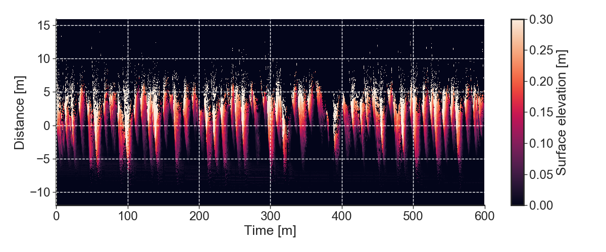

# BeachLiDAR
Process Beach LiDAR data

This repository gathers some tools to process 2D SICK LiDAR data. Please visit https://www.sick.com/

In this repository, we focus only on processing beach data. You will get something that looks like this:


# Install

The easiest way to get up and running is to install everything using Anaconda.

To install Anaconda please refer to: https://www.anaconda.com/download

Then, create an environment named LiDAR and install the following packages:

```bash
# create a new environment
conda create --name LiDAR python=3.7
# activate
source activate LiDAR
# ipython
conda instal ipython
# install the netCDF4 and xarray
conda install netCDF4 xarray
# install seaborn for better plots
conda install seaborn
# timezones
conda install pytz
# scikits
conda install scikit-learn scikit-image
# progress bar
```

# Converting to netCDF

NetCDF has a lot of advantages when compared to tabular file formats used by SICK. The first step to process your data is to convert everything to netCDF.

SICK software (SOPAS) will only export Excel or CSV files. Do not use Excel files! The only can hold a very limited amount of records and will make your life harder. In SOPAS, export your recorded data to CSV. No need to break the files into smaller ones. Our parser will handle any input file size.

**Import**: The recorded variable you want to use is called *ScanData*.

Now, call the command:

```bash
python LiDAR2nc -i ScanData.csv -o ScanData.nc
```

**NOTE**: you may need to adjust your Timezone. Modify lines 234 and 235 in
LiDAR2nc.py if needed.

```python
TIMEZONE = "Australia/Sydney"
DATE_FMT = "%Y-%m-%d %H:%M:%S.%f AEST(+1000)"
```

That's it. You now have a netCDF file with the following structure:

```python
<xarray.Dataset>
Dimensions:   (points: 1141, time: 103433)
Coordinates:
  * points    (points) int64 0 1 2 3 4 5 6 ...
  * time      (time) datetime64[ns] 2018-04-24T00:42:21.560000 ...
Data variables:
    x         (time, points) float64 ...
    y         (time, points) float64 ...
    distance  (time, points) float64 ...
    angles    (time, points) float64 ...
```

# Re-sampling your data

You may wish to reduce your file sizes. Re-sampling is a good way to do this.

```bash
python resample.py ScanData.nc "0.25S"
```

For the accepted offset strings, please see: https://pandas.pydata.org/pandas-docs/stable/reference/api/pandas.Series.resample.html

# Extracting a beach profile

Most of the utilities in this repository require a beach profile. If you don't have a measured profile that matches your LiDAR line, you can get one from the LiDAR itself.

To get a profile using some of the recorded data, one can do:

```bash
python get_profile_from_lidar.py -i ScanData.nc -o Profile.csv --start YYYYMMDD-HH:MM:SS -dt 5
```

The options are:

* [Mandatory] **--input/-i** Input file name. Needs to be NetCDF (see Lidar2nc.py)
* [Mandatory] **--output/-i** *Output file name. This will be in CSV format.*
* [Mandatory] **--start/-t1** *Start time in YYYYMMDD-HH:MM:SS format.*
* [Mandatory] **--dt/-dt** *Duration of record to used in minutes*
* [Optional] **--lidar-coords/-coords/-xy** *Surveyed coordinates*
* [Optional] **--xlim/-xlim** *Analysis limits in the x-direction*
* [Optional] **--ylim/-ylim** *Analysis limits in the x-direction*
* [Optional] **--cut/-cut** *Forced analysis limits in the x-direction*
* [Optional] **--order/-order** *Order of the polynomial for interpolations*
* [Optional] **--theta/-theta** *Rotation angle in degrees*
* [Optional] **--dx/-dx** *Resolution in the x-coordinate*


# Extracting a time-space file (timestack)

Now we have everything we need to extract a timestack. Simply call:

```bash
python lidar_timestack.py -i ScanData.nc -o Timestack.nc -p Profile.csv --start YYYYMMDD-HH:MM:SS --end YYYYMMDD-HH:MM:SS
```

The options are:

* [Mandatory] **--input/-i** Input file name. Needs to be NetCDF (see Lidar2nc.py)
* [Mandatory] **--output/-i** *Output file name. This will be in CSV format.*
* [Mandatory] **--profile/-p** *Profile file name (see get_profile_from_lidar.py).*
* [Mandatory] **--start/-t1** *Start time in YYYYMMDD-HH:MM:SS format.*
* [Mandatory] **--end/-t2** *End time in YYYYMMDD-HH:MM:SS format.*
* [Mandatory] **--dt/-dt** *Duration of record to used in minutes*
* [Optional] **--lidar-coords/-coords/-xy** *Surveyed coordinates*
* [Optional] **--xlim/-xlim** *Analysis limits in the x-direction*
* [Optional] **--ylim/-ylim** *Analysis limits in the x-direction*
* [Optional] **--cut/-cut** *Forced analysis limits in the x-direction*
* [Optional] **--order/-order** *Order of the polynomial for interpolations*
* [Optional] **--theta/-theta** *Rotation angle in degrees*
* [Optional] **--dx/-dx** *Resolution in the x-coordinate*

If everything goes right, you can plot your timestack:




# Disclaimer:

This software is available "as is". Please don't blame me if it does not work out-of-the-box for your particular application.
